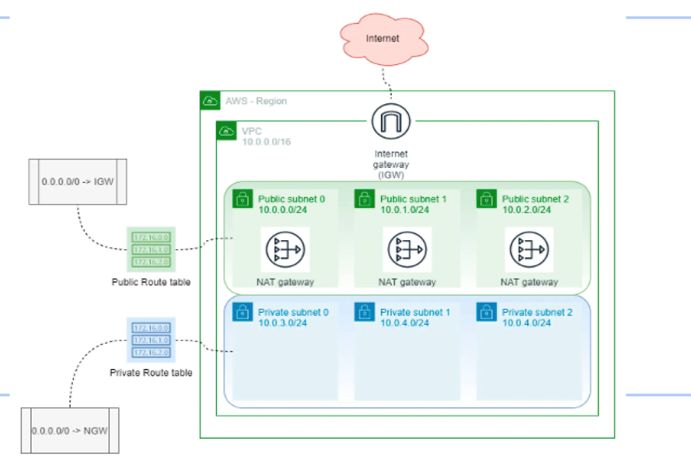

<h1>Simple VPC in AWS</h1>

<h2> Overview of the VPC</h2>

This is a simple VPC (Virtual private cloud) in AWS. It has the following components:
<ul>
<li>3 public subnets that each contain a NAT (Network Address Translation service that lets instances in a private subnet connect to services outside the VPC without exposing them to internet traffic).</li>
<li>3 private subnets which are not directly accessible from the internet, don't have public IP addresses, and can only access the internet via a NAT. </li>
<li>An internet gateway that allows instances in the public subnets to connect to the internet.</li>
<li>A public route table that routes traffic destined for the internet through the internet gateway.</li>
<li>A private route table that routes traffic destined for the internet through the NAT.</li>
</ul>

<h2>VPC Talking points</h2>
To run, you run terraform init then terraform apply to make the changes to AWS. Terraform destory deletes everything in config file (opposite of apply)
.A linux based EC2 instance has been deployed to each private subnet (AMI ID=ami-0c36451c41e1eefd2). The region has been set to us-west-2. The instance type is t2.micro. §
<ul>
<li>CIDR block = collection of IP addresses that share the same network prefix and number of bits</li>
<li>Terraform, an infrastructure as code tool that can provision resources in the cloud from declarative code, is used to make the VPC. Has the benefits of being able to manage infrastructure across different cloud platforms using a single tool, can be reused easily, is safer, and CI can be automated easier. </li>
<li>The code has been stored on github in a private git repository. Git is a version control system that makes keeping history of changes, collaborating with other developers, and continuous integration easy. Git repositories can be hosted on platforms such as github which provides an interface and collaborative environment for managing repositories.</li>
</ul>